# Laporan Resmi Praktikum Modul 1
## Komunikasi Data dan Jaringan Komputer

**Kelompok:** K-68 (Group C)
**Repository:** Jarkom-Modul-1-2026-K-68
**Ip Group:** 10.4.89.250 

| Nama | NRP | Pembagian |
|---|---|---|
| Ryan Adya Purwanto | 5027231046 | Soal 1–14 |
| Made Gde Krisna Wangsa | 5027201047 | Soal 15–20 |


Tema soal: *Serial Experiments Lain* Lain berperan sebagai Router membangun jaringan "The Wired".

---

## Arsitektur Jaringan

Topologi dibangun di GNS3 menggunakan image Docker debinet untuk seluruh node. (Group C)

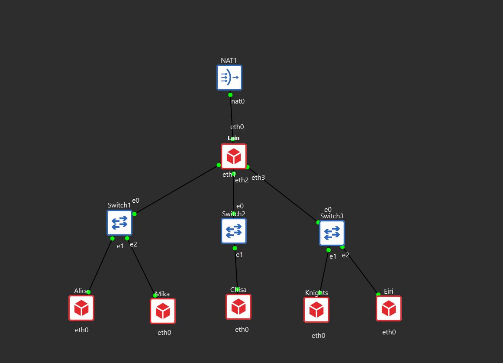

Interface router: eth0→NAT1, eth1→Switch1, eth2→Switch2, eth3→Switch3.

### Skema Pengalamatan IP (prefix 192.245)

| Node | Interface | Mode | IP | Netmask | Gateway |
|---|---|---|---|---|---|
| Lain | eth0 | DHCP (NAT) | 192.168.122.x | — | automatic |
| Lain | eth1 | Static | 192.245.1.1 | 255.255.255.0 | — |
| Lain | eth2 | Static | 192.245.2.1 | 255.255.255.0 | — |
| Lain | eth3 | Static | 192.245.3.1 | 255.255.255.0 | — |
| Alice | eth0 | Static | 192.245.1.2 | 255.255.255.0 | 192.245.1.1 |
| Mika | eth0 | Static | 192.245.1.3 | 255.255.255.0 | 192.245.1.1 |
| Chisa | eth0 | Static | 192.245.2.2 | 255.255.255.0 | 192.245.2.1 |
| Knights | eth0 | Static | 192.245.3.2 | 255.255.255.0 | 192.245.3.1 |
| Eiri | eth0 | Static | 192.245.3.3 | 255.255.255.0 | 192.245.3.1 |

Subnet: Switch1 = 192.245.1.0/24, Switch2 = 192.245.2.0/24, Switch3 = 192.245.3.0/24.

---

## Soal 1

### Membangun Topologi The Wired

Topologi disusun dari 10 node: 1 NAT (gateway internet), 1 router (Lain), 3 switch, dan 5 client. Router Lain menggunakan empat interface dengan pembagian:

| Interface Router | Tersambung ke |
|---|---|
| eth0 | NAT1 (jalur WAN menuju internet) |
| eth1 | Switch1 (segmen Alice & Mika) |
| eth2 | Switch2 (segmen Chisa) |
| eth3 | Switch3 (segmen Knights & Eiri) |

Setiap client dihubungkan ke switch pada segmennya masing-masing, sehingga terbentuk tiga subnet terpisah yang semuanya melewati router Lain untuk saling berkomunikasi maupun keluar ke internet.

Verifikasi: Pemetaan interface router dicek melalui label link di GNS3 dan perintah ip -br link pada konsol Lain untuk memastikan keempat interface (eth0–eth3) tersambung ke tujuan yang benar dan berstatus UP.


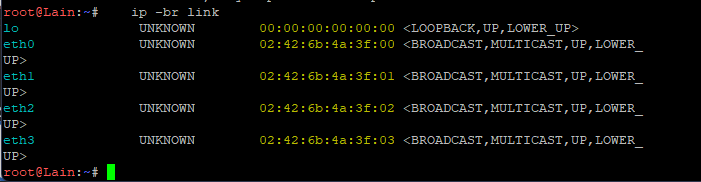

---

## Soal 2 

Langkah: Melalui menu Configure → Network configuration pada node Lain di GNS3, interface eth0 diatur sebagai DHCP client (iface eth0 inet dhcp). Berbeda dengan eth1–eth3 yang memakai IP statis, eth0 memakai DHCP karena alamatnya disediakan langsung oleh NAT. Konfigurasi otomatis diterapkan saat node dijalankan.


~~~
auto eth0
iface eth0 inet dhcp
~~~

Verifikasi `ip a show eth0` pada Lain untuk menunjukkan eth0 memperoleh ip dari NAT.

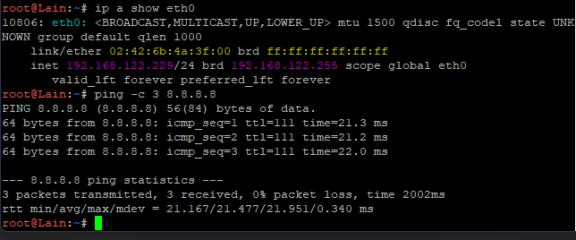

---

## Soal 3

Setiap interface router (eth1–eth3) diberi IP statis sebagai gateway masing-masing subnet, dan setiap client dikonfigurasi dengan IP statis serta gateway yang mengarah ke interface router pada subnetnya. 

### Konfigurasi di Lain

~~~
auto eth1
iface eth1 inet static
    	address 192.245.1.1
    	netmask 255.255.255.0

auto eth2
iface eth2 inet static
   	 address 192.245.2.1
    	netmask 255.255.255.0

auto eth3
iface eth3 inet static
    	address 192.245.3.1
    	netmask 255.255.255.0
~~~

Agar router dapat meneruskan paket antar-subnet, IP forwarding diaktifkan melalui `sysctl -w net.ipv4.ip_forward=1` (pada DebiNet nilai ini sudah 1 secara default, namun tetap ditulis eksplisit untuk menjamin).

### Konfigurasi Clients

### Alice
~~~
auto eth0
iface eth0 inet static
    	address 192.245.1.2
    	netmask 255.255.255.0
    	gateway 192.245.1.1
~~~
### Mika
~~~
auto eth0
iface eth0 inet static
    	address 192.245.1.3
    	netmask 255.255.255.0
    	gateway 192.245.1.1
~~~
### Chisa
~~~
auto eth0
iface eth0 inet static
    	address 192.245.2.2
    	netmask 255.255.255.0
    	gateway 192.245.2.1
~~~
### Knights
~~~
auto eth0
iface eth0 inet static
    	address 192.245.3.2
    	netmask 255.255.255.0
    	gateway 192.245.3.1
~~~
### Eiri
~~~
auto eth0
iface eth0 inet static
    	address 192.245.3.3
    	netmask 255.255.255.0
    	gateway 192.245.3.1
~~~


Pengujian dilakukan dari Alice (192.245.1.2, subnet SW1) ke Chisa (192.245.2.2, subnet SW2) dengan `ping`.

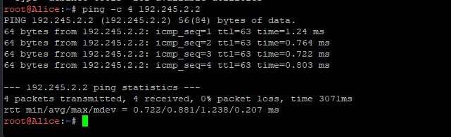

---

## Soal 4

Agar seluruh client di jaringan lokal dapat mengakses internet, router Lain menerapkan **Source NAT (MASQUERADE)** pada interface WAN (eth0). Mekanisme ini menerjemahkan alamat privat client (192.245.x.x) menjadi alamat publik router saat paket keluar ke internet. Aturan ditambahkan pada tabel NAT iptables:

~~~
iptables -t nat -A POSTROUTING -o eth0 -j MASQUERADE
~~~


Selain itu tiap client diberi DNS resolver:

~~~
echo "nameserver 8.8.8.8" > /etc/resolv.conf
~~~

Pengujian dilakukan dari client (Alice) dengan `ping -c 4 google.com`. Ping berhasil dengan domain ter-resolve ke alamat IP dan mendapat balasan, membuktikan client sudah dapat menjangkau internet melalui NAT dan DNS berfungsi.


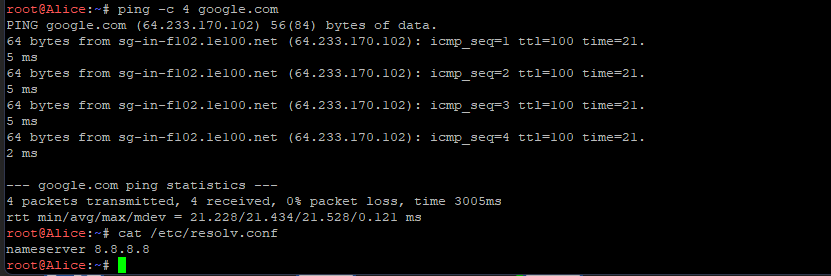

---

## Soal 5

Agar konfigurasi tidak hilang saat node restart, perintah runtime dititipkan ke `/etc/network/interfaces` menggunakan awalan `up` (dijalankan otomatis saat interface naik).

**Konfigurasi Router Lain di`/etc/network/interfaces` Menjadi:**

~~~
auto eth0
iface eth0 inet dhcp
    up sysctl -w net.ipv4.ip_forward=1
    up iptables -t nat -A POSTROUTING -o eth0 -j MASQUERADE

auto eth1
iface eth1 inet static
    address 192.245.1.1
    netmask 255.255.255.0

auto eth2
iface eth2 inet static
    address 192.245.2.1
    netmask 255.255.255.0

auto eth3
iface eth3 inet static
    address 192.245.3.1
    netmask 255.255.255.0
~~~

**Client (contoh Alice) di`/etc/network/interfaces` Menjadi:**

~~~
auto eth0
iface eth0 inet static
    address 192.245.1.2
    netmask 255.255.255.0
    gateway 192.245.1.1
    up bash /root/dns.sh
~~~

**`/root/dns.sh` (tiap client):**

```bash
#!/bin/bash
echo "nameserver 8.8.8.8" > /etc/resolv.conf
```

**`/root/cek_status.sh` (di Lain):**

```bash
#!/bin/bash
echo "Ringkasan Interface"
ip -br a
echo
echo "Status Tabel NAT"
iptables -t nat -L -v -n
```

Pengujian dilakukan dengan me-restart seluruh node, lalu menjalankan `ping google.com` dari client tanpa mengkonfigurasi ulang. Seluruh client tetap terhubung ke internet dan aturan MASQUERADE tetap ada, membuktikan konfigurasi telah persisten.

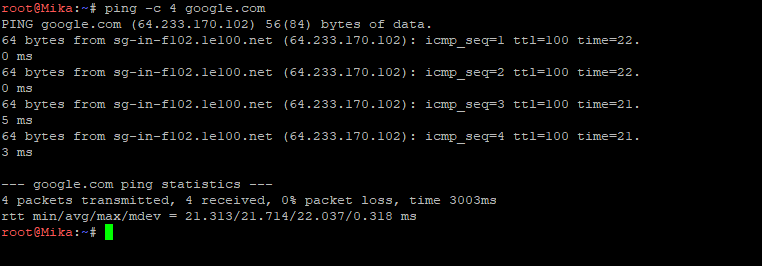
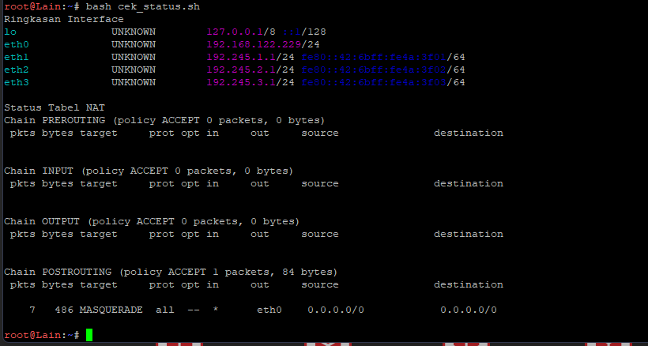

---

## Soal 6

Untuk mengamati trafik jaringan, dilakukan penyadapan (sniffing) pada link Mika -> Switch1 melalui fitur *Start capture* di GNS3 yang membuka Wireshark. 

Sementara capture berjalan, dari Mika dijalankan script generator trafik (`traffic_protocol7.sh`) yang berisi rangkaian `ping` ke beberapa alamat (8.8.8.8, 1.1.1.1, its.ac.id) serta query DNS (`nslookup`/`dig`) ke beberapa domain (google, its.ac.id, github, example, cloudflare).

### traffic_protocol7.sh
~~~bash
#!/bin/bash
# ============================================
# Traffic Generator — Protocol 7 Network
# Serial Experiments Lain — Modul 1 Jarkom 2026
# Jalankan di node MIKA untuk generate traffic DNS & ICMP
# ============================================

echo "============================================"
echo "  Protocol 7 Traffic Generator v2026"
echo "  Node: Mika Iwakura"
echo "============================================"
echo "[*] Generating DNS & ICMP traffic..."

# ICMP Traffic
ping -c 5 8.8.8.8 &
ping -c 5 1.1.1.1 &
ping -c 3 its.ac.id &

# DNS Queries
nslookup google.com 8.8.8.8 &
nslookup its.ac.id 8.8.8.8 &
nslookup github.com 1.1.1.1 &
dig @8.8.8.8 example.com A &
dig @1.1.1.1 cloudflare.com AAAA &

wait
echo "[*] Traffic generation complete."
echo "[*] Check Wireshark for captured packets."
~~~

Pada Wireshark, trafik disaring dengan display filter:

~~~
dns || icmp
~~~

Filter ini menyisakan 48 dari 52 paket (92,3%) yang merupakan trafik DNS dan ICMP saja. Terlihat paket ICMP Echo Request/Reply antara Mika (192.245.1.3) dengan 8.8.8.8, 1.1.1.1, dan 103.94.189.5 (its.ac.id), serta pasangan DNS query dan response tipe A/AAAA untuk domain-domain yang di-resolve, termasuk respons PTR "No such name" untuk query reverse.

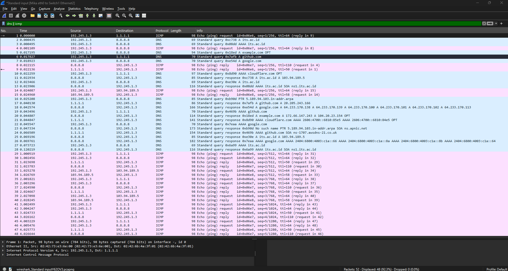

---

## Soal 7

Node Chisa mendirikan FTP server menggunakan vsftpd dengan shared folder `/var/wired/data`. Kebijakan akses dibedakan per-user: `alice` (read + write), `mika` (read-only), dan `eiri` (blacklist / ditolak login). Seluruh konfigurasi disimpan dalam script `/root/setup_ftp.sh`

Script `/root/setup_ftp.sh` (dijalankan di Chisa):

~~~bash
#!/bin/bash
which vsftpd >/dev/null 2>&1 || { apt update || true; apt install -y vsftpd ftp; }

# buat user + password
id alice >/dev/null 2>&1 || useradd -m alice
id mika  >/dev/null 2>&1 || useradd -m mika
id eiri  >/dev/null 2>&1 || useradd -m eiri
echo "alice:alice123" | chpasswd
echo "mika:mika123"   | chpasswd
echo "eiri:eiri123"   | chpasswd

# folder share
mkdir -p /var/wired/data
chown alice:alice /var/wired/data
chmod 755 /var/wired/data

# override read-only khusus mika
mkdir -p /etc/vsftpd/user_conf
echo "write_enable=NO" > /etc/vsftpd/user_conf/mika

# blacklist eiri
echo "eiri" > /etc/vsftpd/user_list

# konfigurasi utama vsftpd
cat > /etc/vsftpd.conf <<'CFG'
listen=YES
listen_ipv6=NO
anonymous_enable=NO
local_enable=YES
write_enable=YES
local_umask=022
chroot_local_user=YES
allow_writeable_chroot=YES
local_root=/var/wired/data
user_config_dir=/etc/vsftpd/user_conf
userlist_enable=YES
userlist_file=/etc/vsftpd/user_list
userlist_deny=YES
seccomp_sandbox=NO
pam_service_name=vsftpd
CFG

service vsftpd restart
echo "[*] FTP ready"
~~~

Penjelasan konfigurasi pada `/etc/vsftpd.conf`:

~~~
local_root=/var/wired/data      # semua user dikurung di folder share
chroot_local_user=YES
allow_writeable_chroot=YES
write_enable=YES                # izin tulis untuk alice
user_config_dir=/etc/vsftpd/user_conf   # override write_enable=NO khusus mika
userlist_file=/etc/vsftpd/user_list     # berisi eiri
userlist_deny=YES               # user pada list ditolak (blacklist)
seccomp_sandbox=NO              # agar vsftpd berjalan di dalam container
~~~

Mekanismenya: `write_enable=YES` global memberi alice hak tulis, sementara mika dibuat read-only lewat file override di `user_config_dir` yang berisi `write_enable=NO`. User eiri dimasukkan ke `userlist_file` dengan `userlist_deny=YES` sehingga ditolak saat login.

**Bukti:**
- User `alice` login (`230 Login successful`) dan mengunggah `signal_alice.txt` (`226 Transfer complete`); file muncul sebagai `-rw-r--r-- alice alice` di `/var/wired/data`.

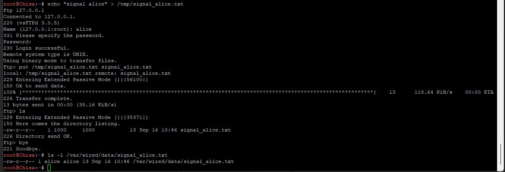

- User `eiri` ditolak dengan `530 Permission denied`.

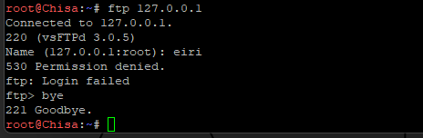

---

## Soal 8

Install ftp:
~~~
apt update && apt install -y ftp
~~~
Node Knights (192.245.3.2) mengunggah file ke FTP server Chisa (192.245.2.2) sambil trafiknya disadap pada link Knights -> Switch3. Client ftp dipasang di Knights, lalu file `/root/knights_report.txt` diunggah dengan login user alice:

~~~
ftp 192.245.2.2
# login: alice / alice123
put /root/knights_report.txt knights_report.txt
~~~

Hasil analisis pada Wireshark (Follow TCP Stream / kolom Info):

- **Perintah STOR** yang mengirim file: `STOR knights_report.txt` (paket 40).
- **Kode sukses transfer**: `226 Transfer complete` (paket 47).
- **Port data (Passive Mode)**: 51613, dibaca dari respons `229 Entering Extended Passive Mode (51613)` (paket 36). Client memakai EPSV (kode 229), yaitu versi modern dari PASV.

Selain itu, terlihat kelemahan protokol FTP: perintah `PASS alice123` terkirim dalam bentuk **plaintext** (paket 12), sehingga kredensial dapat terbaca oleh penyadap.


---

## Soal 9 

Install ftp:
~~~
apt update && apt install -y ftp
~~~
Soal ini menguji kebijakan read-only pada user mika yang diatur di soal 7. 
Sebuah file `protocol7_manifesto.txt` disiapkan di folder share `/var/wired/data` pada Chisa. Dari Mika, dilakukan login FTP sebagai user mika lalu mencoba dua operasi: mengunduh (get) dan mengunggah (put).

Isi dari `protocol7_manifesto.txt`:
~~~
==================================================
  PROTOCOL 7 — THE MANIFESTO
  A Declaration of Digital Consciousness
  Serial Experiments Lain — Year 2026
==================================================

ARTICLE I: THE NATURE OF THE WIRED
-----------------------------------
The Wired is not merely a network of interconnected
machines. It is the collective unconscious of
humanity, rendered in packets and protocols.

Every TCP handshake is a conversation.
Every DNS query is a question.
Every encrypted tunnel is a whispered secret.

ARTICLE II: THE SEVEN PRINCIPLES
----------------------------------
1. All nodes are equal in the eyes of the router.
2. No packet shall be dropped without cause.
3. Encryption is the right of every connection.
4. Plaintext protocols expose the vulnerable.
5. The firewall protects, but also imprisons.
6. NAT masquerade hides truth behind a single face.
7. The Wired remembers everything — packet loss
   is merely a temporary forgetting.

ARTICLE III: THE PROPHECY OF LAIN
-----------------------------------
"If you're not remembered, then you never existed."

In the world of networking, persistence is survival.
A configuration that vanishes upon restart is a
thought that was never truly committed to memory.

Therefore: Save your iptables. Write your interfaces.
Let your routing tables endure beyond the power cycle.

ARTICLE IV: CONCERNING SECURITY
---------------------------------
Telnet is the glass house of protocols — transparent
to any observer with a packet sniffer.

SSH is the steel vault — its contents visible only
to those who possess the key.

Choose wisely which door you open to The Wired.

---
"No matter where you go, everyone's connected."
— Lain Iwakura
~~~

lakukan koneksi ftp dari mika:
~~~
ftp 192.245.2.2
# login: mika / mika123
get protocol7_manifesto.txt      # berhasil
put /root/test_mika.txt          # ditolak
~~~

Hasil:

- **Download berhasil**: `get protocol7_manifesto.txt` mendapat respons `226 Transfer complete`
- **Upload ditolak**: `put /root/test_mika.txt` mendapat respons `550 Permission denied` mika tidak memiliki hak tulis, sesuai konfigurasi `write_enable=NO` pada override user mika.

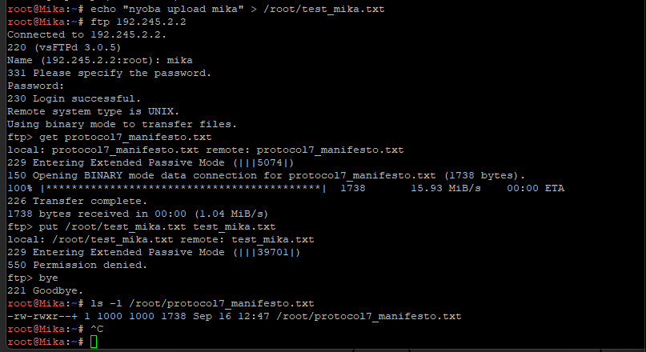

---

## Soal 10

Dilakukan pengujian ketahanan koneksi dari Knights ke Chisa dengan mengirim rangkaian paket ping berukuran besar dan berkelanjutan, sambil menyadap trafik pada link Knights -> Switch3:

~~~
ping -c 77 -s 128 -i 0.3 192.245.2.2
~~~

Keterangan: `-c 77` mengirim 77 paket, `-s 128` menetapkan ukuran payload 128 byte, dan `-i 0.3` memberi jeda 0,3 detik antar paket.

Hasil pengujian:

- **Packet loss: 0%** 77 paket terkirim, 77 diterima, koneksi stabil.
- **RTT** min/avg/max/mdev = 0.444 / 0.577 / 0.878 / 0.106 ms.
- Analisis ICMP di Wireshark: paket permintaan **Echo Request bertipe 8, code 0**, dan balasannya **Echo Reply bertipe 0, code 0** (terlihat pada panel detail ICMP).
- Ukuran tiap frame 170 byte (128 payload + 8 header ICMP + 20 header IP + 14 header Ethernet), dan balasan memiliki **ttl=63** yang menandakan paket melewati satu router.


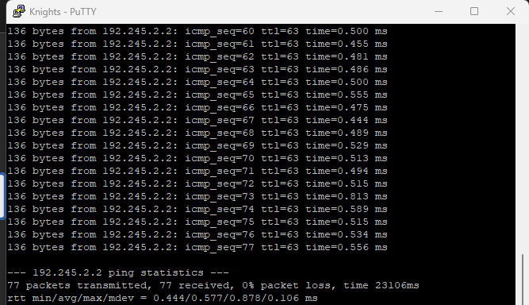
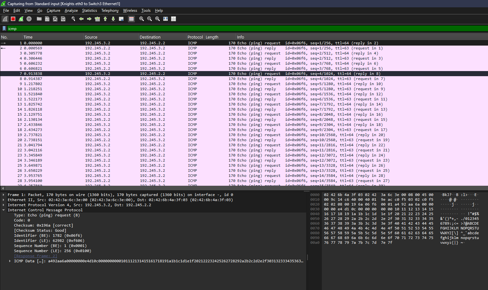

---

## Soal 11

Node Chisa menjalankan layanan Telnet (telnetd) pada port 23 dengan akun korban `phantom_user` / `wired_ghost`. Seluruh konfigurasi disimpan pada script `/root/setup_telnet.sh`. Dari Eiri, dilakukan koneksi Telnet ke Chisa sambil trafiknya disadap pada link Eiri -> Switch3:

Script `/root/setup_telnet.sh` (dijalankan di Chisa):

~~~bash
#!/bin/bash

apt update || true
apt install -y telnetd inetutils-inetd
id phantom_user >/dev/null 2>&1 || useradd -m -s /bin/bash phantom_user
echo "phantom_user:wired_ghost" | chpasswd
sed -i '/telnet/d' /etc/inetd.conf
echo "telnet stream tcp nowait root /usr/sbin/telnetd telnetd" >> /etc/inetd.conf
service inetutils-inetd restart
echo "[*] telnetd siap di port 23"
~~~

~~~
telnet 192.245.2.2
# login: phantom_user / wired_ghost
whoami
~~~

Hasil analisis di Wireshark dengan **Follow TCP Stream**:

- Kredensial terlihat dalam bentuk **plaintext**: prompt `Password:` diikuti `wired_ghost`, lalu prompt shell `phantom_user@Chisa:~$`. Ini membuktikan Telnet tidak mengenkripsi trafik sehingga username dan password dapat terbaca penuh oleh penyadap.
- Pada daftar paket, setiap karakter yang diketik muncul sebagai segmen TCP terpisah berisi 1 byte data. Hal ini karena Telnet menggunakan **character-at-a-time mode** setiap penekanan tombol langsung dikirim sebagai satu segmen TCP (dengan flag PSH) dan di-echo balik oleh server.

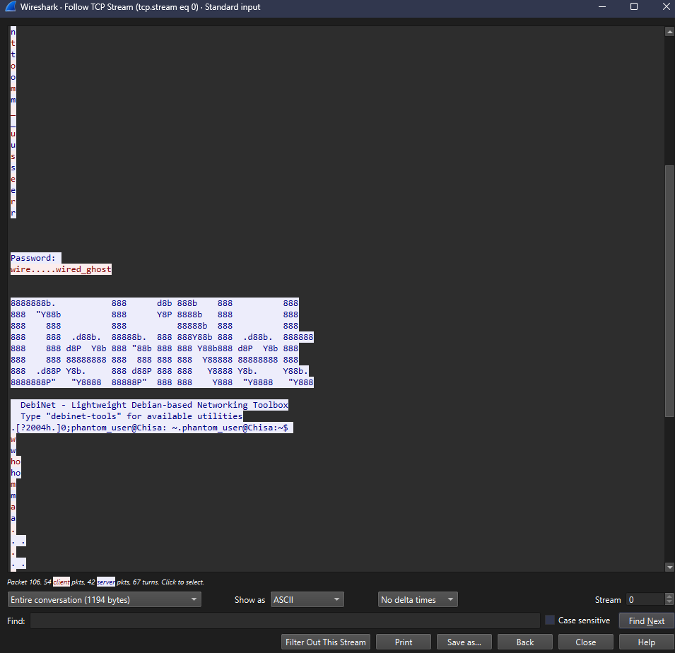

---

## Soal 12

Node Knights membuka dua port layanan: port 22 (SSH, via `service ssh start`) dan port 80 (via `nc -lk -p 80`), sementara port 7777 sengaja dibiarkan tertutup. Dari Alice dilakukan pemindaian port menggunakan netcat, sambil trafik disadap pada link Alice -> Switch1:

~~~
nc -zv 192.245.3.2 22 80 7777
~~~

Keterangan: `-z` melakukan scan tanpa mengirim data (zero-I/O), `-v` menampilkan hasil verbose.

Hasil analisis TCP flags di Wireshark:

- **Port 22 dan 80 (terbuka)** → server membalas dengan **SYN, ACK** (Flags `0x012`), menandakan port siap menerima koneksi (three-way handshake berlanjut).
- **Port 7777 (tertutup)** → server membalas dengan **RST, ACK** (Flags `0x014`), yang langsung memutus percobaan koneksi.

Perbedaan intinya: port terbuka menyelesaikan handshake (SYN-ACK), sedangkan port tertutup menolak seketika (RST-ACK). Sebagai bonus, terlihat pula banner `SSH-2.0-OpenSSH_10.0p2` dari port 22.

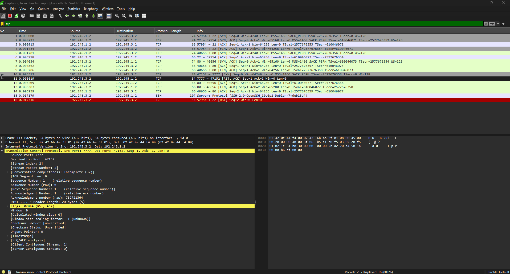

---

## Soal 13 

Node Knights menjalankan SSH server (openssh-server) dengan user `mika_admin`, dikonfigurasi hanya menerima autentikasi kunci (`PasswordAuthentication no` pada `/etc/ssh/sshd_config`). Dari Mika dibuat pasangan kunci dengan `ssh-keygen -t rsa -b 2048`, lalu kunci publik disalin ke Knights menggunakan `ssh-copy-id` (private key tetap di Mika). Koneksi SSH kemudian dilakukan sambil disadap pada link Mika -> Switch1:

~~~
ssh-keygen -t rsa -b 2048          # di Mika
ssh-copy-id mika_admin@192.245.3.2 # salin public key ke Knights
ssh mika_admin@192.245.3.2         # login TANPA password
~~~

Hasil analisis di Wireshark:

- **Protocol Version Exchange**: kedua sisi bertukar versi `SSH-2.0-OpenSSH_10.0p2` (paket 4 dari client, paket 6 dari server).
- **Key Exchange**: terlihat paket Key Exchange Init, lalu PQ/T Hybrid Key Exchange, dan diakhiri New Keys.
- Setelah tahap **New Keys**, seluruh paket berikutnya tampil sebagai **Encrypted Packet** isi sesi tidak dapat dibaca.

Berbeda dengan Telnet (soal 11) yang menampilkan kredensial plaintext, sesi SSH tidak menampilkan username maupun password karena: (1) seluruh trafik terenkripsi setelah proses Key Exchange, dan (2) autentikasi memakai pasangan kunci private key tidak pernah dikirim melalui jaringan, hanya digunakan untuk membuktikan kepemilikan secara kriptografis.

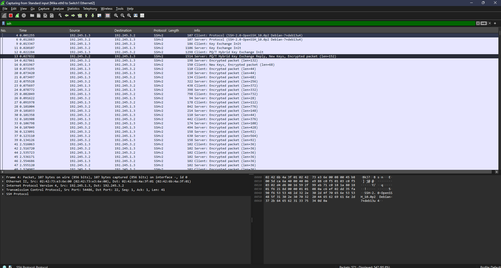

---

## Soal 14

analisis dari `soal14_wired_bruteforce.pcapng` untuk mengidentifikasi serangan brute-force terhadap halaman login web.

**Metode analisis (Wireshark):**

1. Menyaring seluruh percobaan login dengan filter request POST:
   ~~~
   http.request.method == "POST"
   ~~~
2. Menambahkan kolom **User-Agent** (klik kanan field `http.user_agent` → Apply as Column) untuk melihat tool yang dipakai tiap request.
3. Penyerang diidentifikasi sebagai IP yang **membanjiri** endpoint `POST /login.php` dengan ratusan percobaan memakai User-Agent tool brute-force. Beberapa IP lain yang hanya mengirim satu paket merupakan **decoy** dan bukan pelaku sebenarnya.
4. Menyaring respons yang berhasil untuk menemukan kredensial yang tembus:
   ~~~
   http.response.code == 200
   ~~~
   lalu **Follow HTTP Stream** pada paket tersebut untuk membaca username/password yang berhasil beserta header respons.
5. Port layanan target dibaca dari **TCP Destination Port** dan header `Host`.

**Hasil temuan:**

| Item | Nilai |
|---|---|
| IP penyerang | 172.26.7.50 |
| Tool yang digunakan | ffuf (Fuzz Faster U Fool v2.1.0-dev) |
| Endpoint target | `172.26.7.100:8080` (port 8080) |
| Kredensial didapat | `lain_admin` / `wired_pr0tocol_7` |
| Server | Apache/2.4.62 |

**Decoy :**

- `172.26.7.60` User-Agent `Mika-Browser/1.0`
- `172.26.7.92` User-Agent `masscan/1.3`

**Validasi:** hasil dikonfirmasi ke server praktikum dengan `nc 10.4.89.250 3401`, dan flag berhasil diperoleh:

~~~
KOMJAR26{W1r3d_Brut3_ofGWOszZFdRWl2gbaXEJsvORj}
~~~

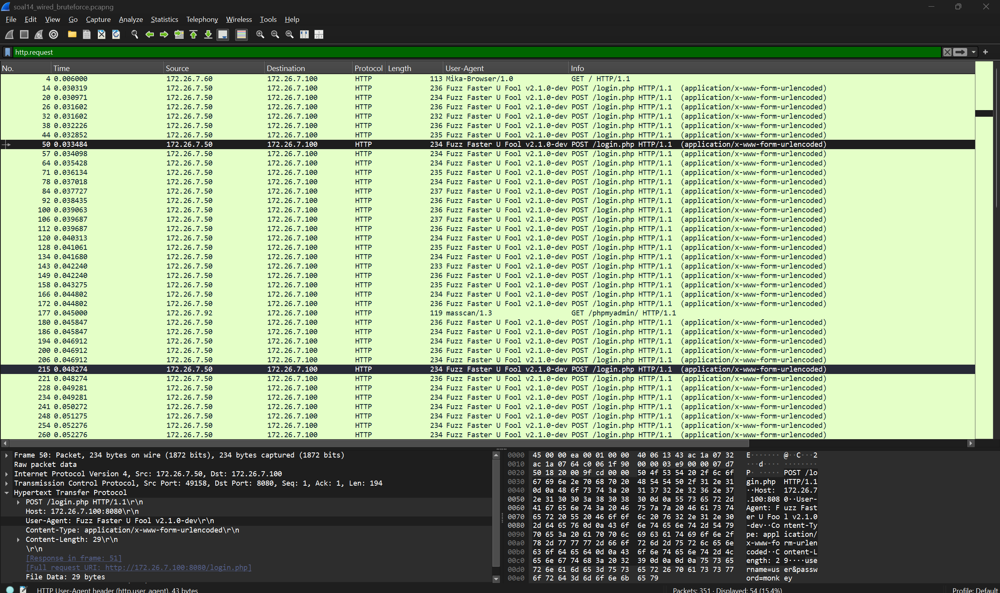

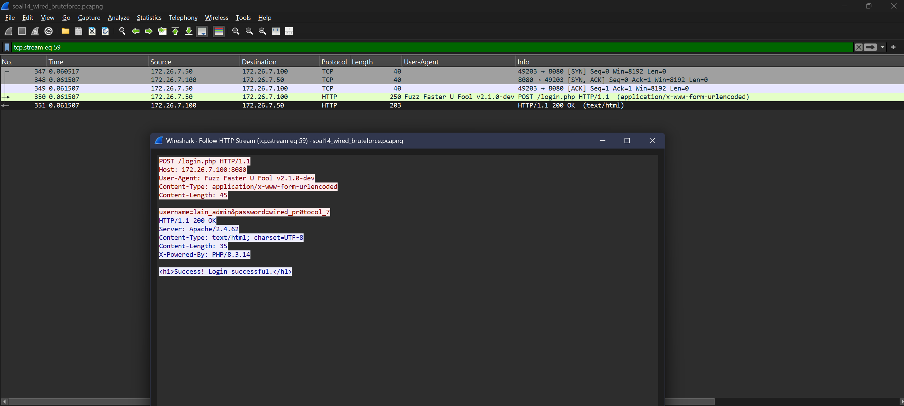

---

# BAGIAN ANALISIS PCAP (Soal 15–20) — dikerjakan oleh Made Gde Krisna Wangsa

> Analisis berkas `.pcap` yang disediakan asisten. Setiap temuan divalidasi ke server praktikum (IP group `10.4.89.250`) dengan `nc 10.4.89.250 <port>`.

## Soal 15 — USB HID (`wired_usb_hid.pcap`) — validasi nc port 3402

Berkas dibuka di Wireshark, lalu **Device Descriptor** diperiksa (panel kiri bawah) untuk membaca identitas perangkat. Isi ketikan direkonstruksi dari **Leftover Capture Data** pada tiap HID report 8-byte (byte ke-3 = keycode, byte ke-1 = modifier/Shift). Berkas diekspor sebagai plaintext, lalu keycode diterjemahkan menjadi teks menggunakan USB HID Keycode Decoder.

| Temuan | Nilai |
|---|---|
| Vendor ID | `0x046d` (Logitech, Inc.) |
| Product ID | `0xc31c` (Keyboard K120) |
| Alamat device USB | `2.7.1` |
| Pesan rahasia | `Wired_Protocol_7_is_alive_2026` |
| Flag validasi | `KOMJAR26{USB_K3ystr0k3_zWwnYRYEEQXKwDvQBtrYQOmHf}` |

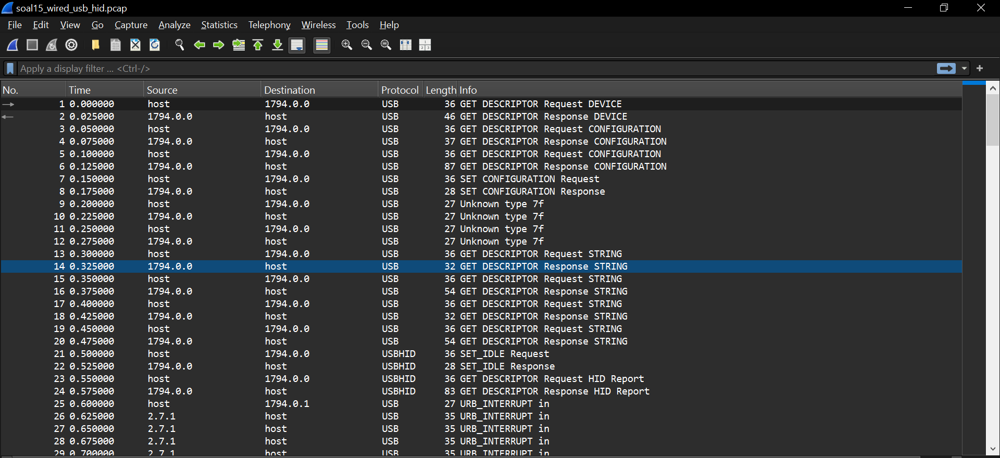

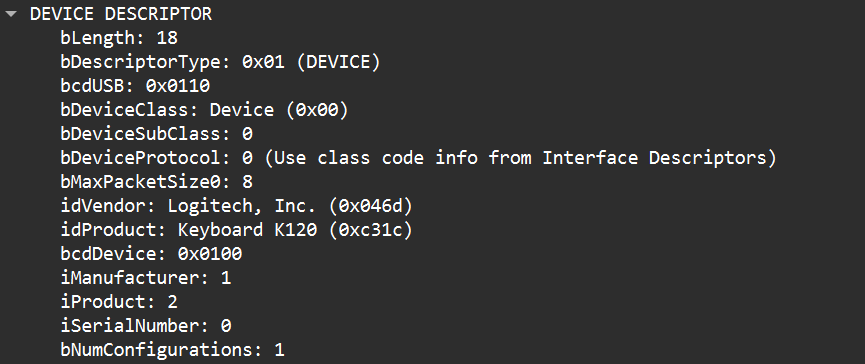

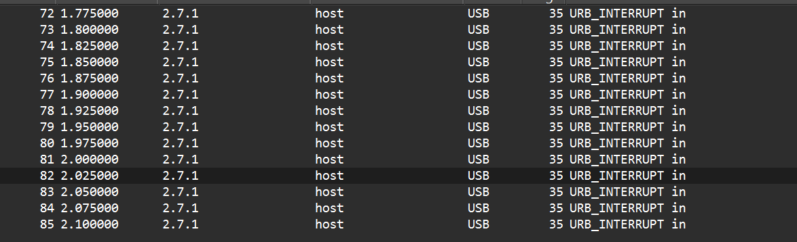


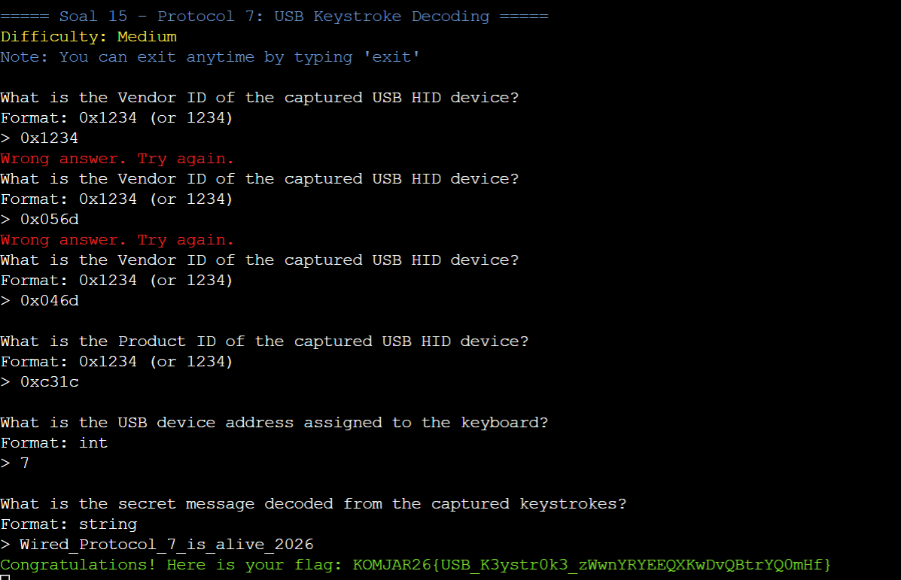

---

## Soal 16 — FTP theft (`wired_ftp_theft.pcap`) — validasi nc port 3403

Trafik disaring dengan filter `ftp || ftp-data`, lalu Follow TCP Stream untuk mengidentifikasi server penyerang, banner software, kredensial login, dan ukuran file yang dicuri.

| Temuan | Nilai |
|---|---|
| IP server FTP | `198.51.100.7` |
| Banner software FTP | `vsftpd 3.0.5` |
| Username | `knights_agent` |
| Password | `N4v1_s3cur3_2026` |
| Ukuran file (bytes) | `524288` |
| Flag validasi | `KOMJAR26{FTP_Th3ft_R2ezQCoEsXG66qwXkkMeQTanq}` |

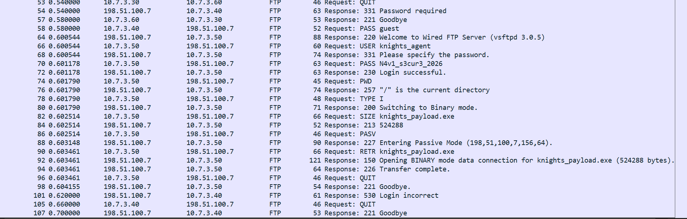

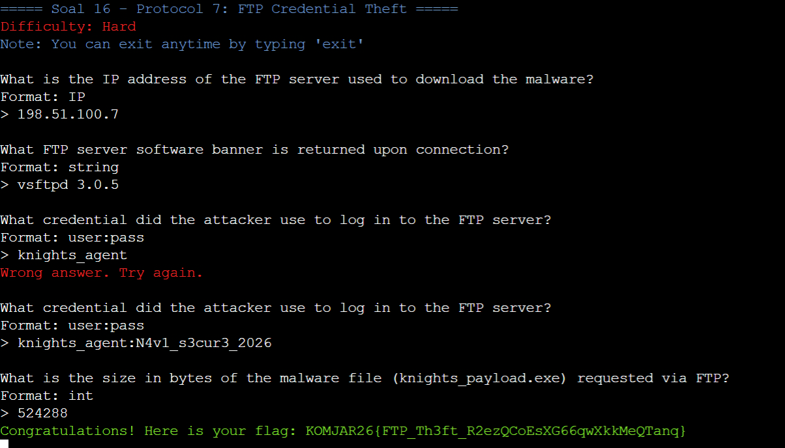

---

## Soal 17 — HTTP C2 (`wired_http_c2.pcap`) — validasi nc port 3404

Trafik disaring dengan filter `http` untuk menemukan request `GET` yang mengunduh file malware dari server Command & Control.

| Temuan | Nilai |
|---|---|
| Domain (Host) | `wired-update.net` |
| IP server penyerang | `203.0.113.42` |
| Nama file malware | `navi_agent.exe` |
| HTTP status code | `200` |
| Flag validasi | `KOMJAR26{Navi_C2_D0wnl04d_uApWZjAmB2PSUAqwE8pqLXhom}` |

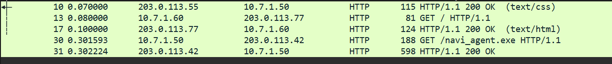

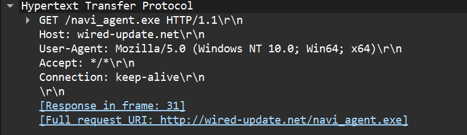

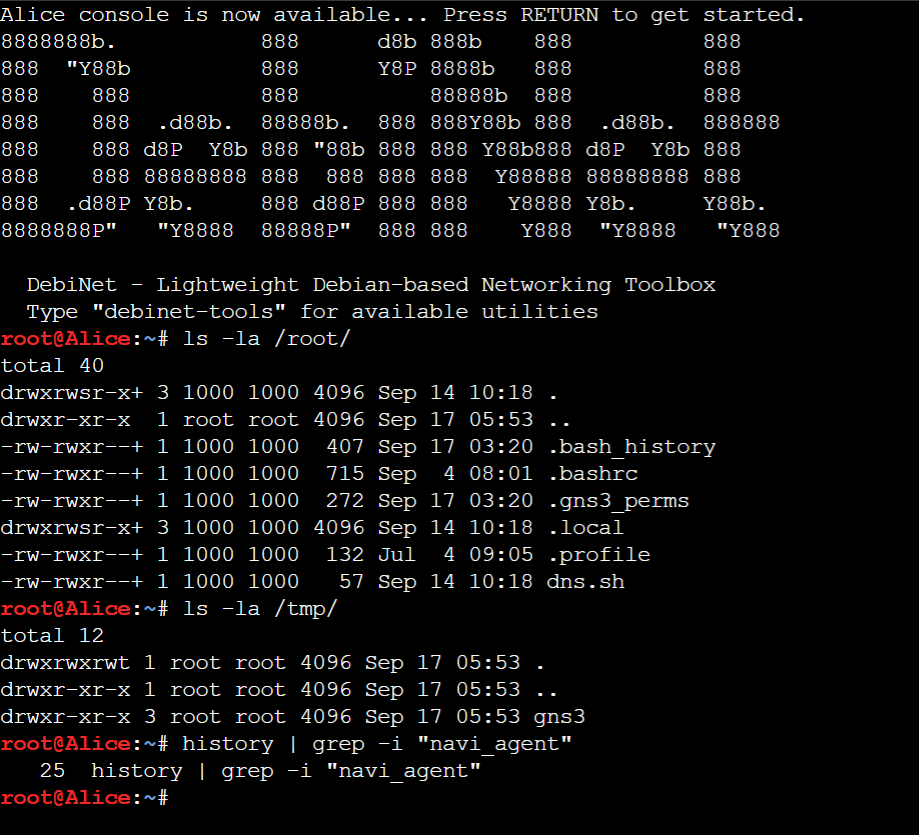

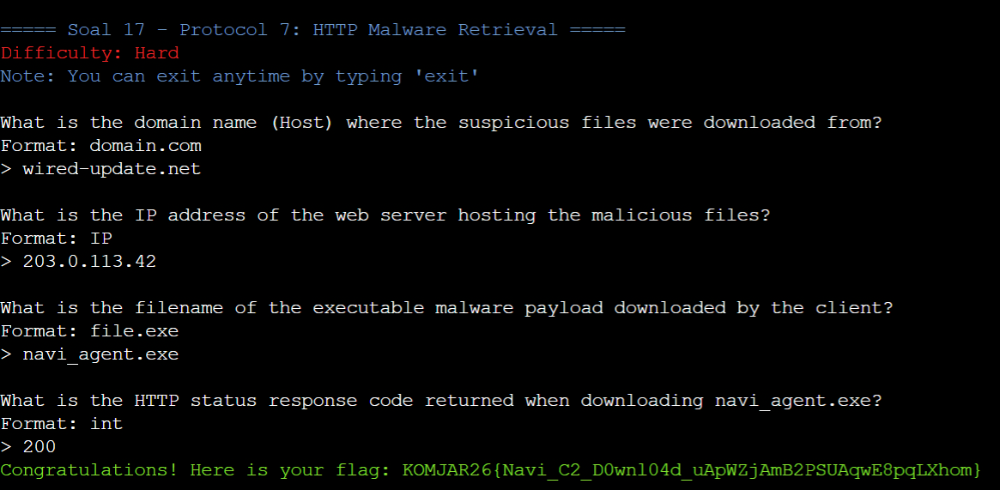

---

## Soal 18 — SMB transfer (`wired_smb_transfer.pcapng`) — validasi nc port 3405

Trafik disaring dengan filter `smb2` untuk melacak transfer file executable melalui protokol SMB.

| Temuan | Nilai |
|---|---|
| Protokol | SMB (SMB2) |
| IP pengirim (attacker) | `10.7.3.100` |
| IP penerima (victim) | `10.7.1.50` |
| Folder tujuan | `ADMIN$` → `System32` |
| Nama file executable | `wired_trojan_payload.exe` |
| Flag validasi | `KOMJAR26{SMB_Tr4nsf3r_Tssoap3oiw7cU1I0Eq7fldJSv}` |

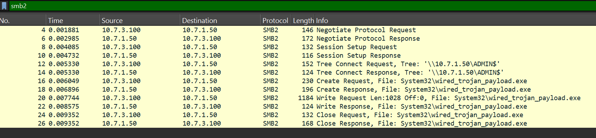

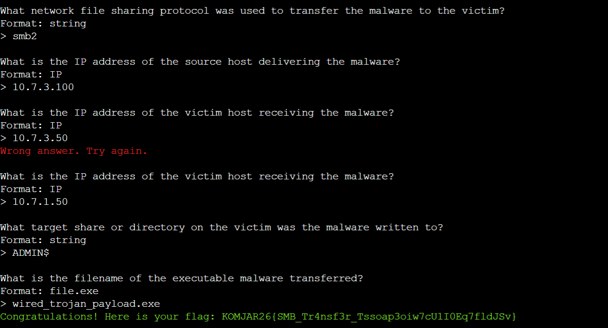

---

## Soal 19 — SMTP threat (`wired_smtp_threat.pcap`) — validasi nc port 3406

Trafik disaring dengan filter `smtp`, lalu Follow TCP Stream untuk membaca isi email pemerasan yang membocorkan password korban dan mengirim malware.

| Temuan | Nilai |
|---|---|
| Email korban | `victim@protocol7.co.jp` |
| Password korban (bocor) | `pr0tocol_7_user` |
| Jenis malware | ransomware |
| Batas waktu (hari) | `3` |
| MailClientID | `7719980706` |
| Flag validasi | `KOMJAR26{SMTP_Ext0rt10n_ZFLfjUJOsNM9wPysEm9m3ZIlt}` |

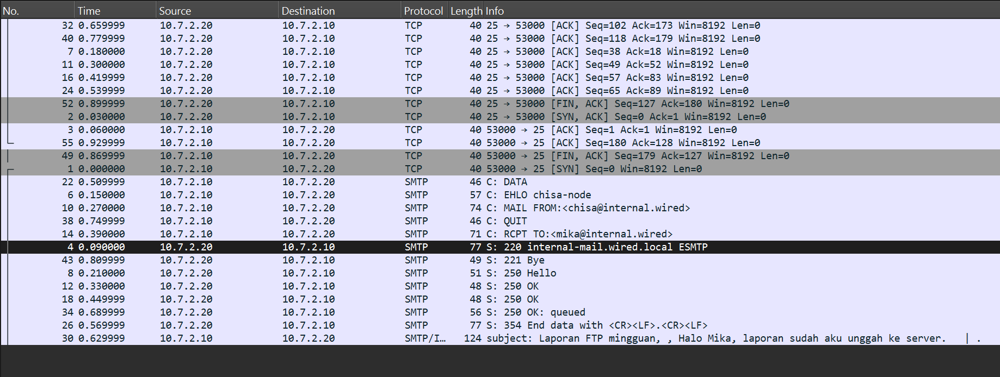

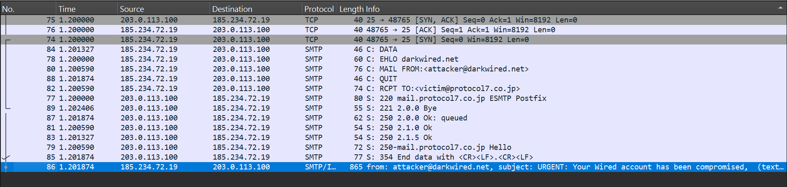

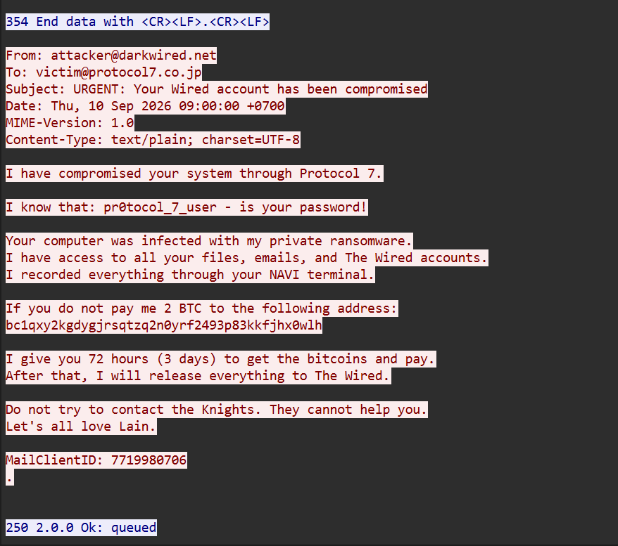

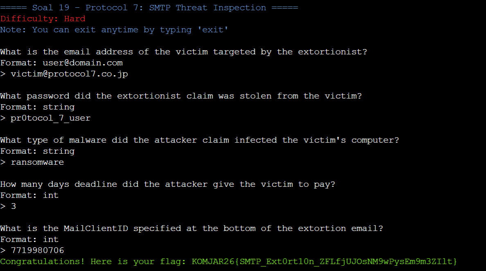

---

## Soal 20 — TLS decrypt (`wired_tls_decrypt.pcapng` + `keyslogfile.txt`) — validasi nc port 3407

Dekripsi diaktifkan dengan memasukkan `keyslogfile.txt` ke Wireshark (Edit → Preferences → Protocols → TLS → (Pre)-Master-Secret log filename). Setelah trafik terdekripsi, isi HTTP di dalam TLS dapat dibaca.

| Temuan | Nilai |
|---|---|
| Versi TLS | TLSv1.2 |
| SNI (domain) | `example.com` |
| IP server HTTPS | `93.184.216.34` |
| User-Agent | `curl/7.62.0` |
| HTTP method + path | `HEAD /` |
| Flag validasi | `KOMJAR26{TLS_D3crypt_cTtcuYV9AqEArZEauyuYNJzim}` |

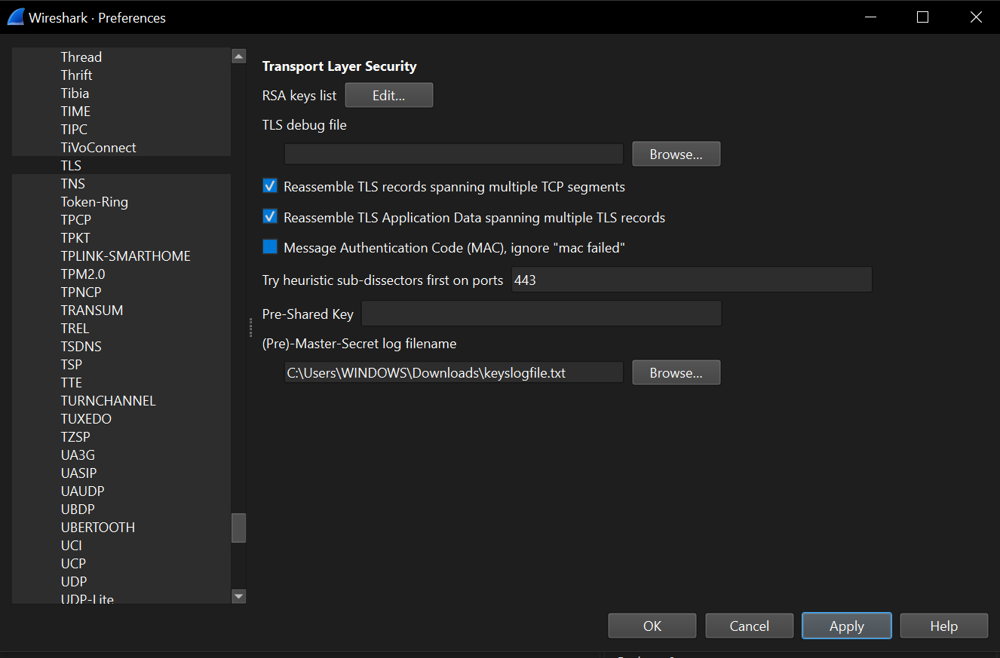

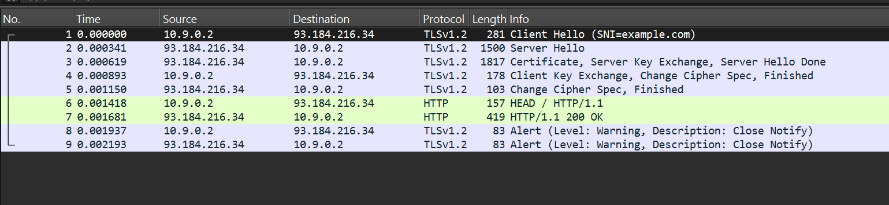

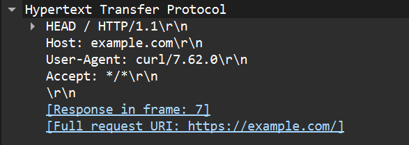

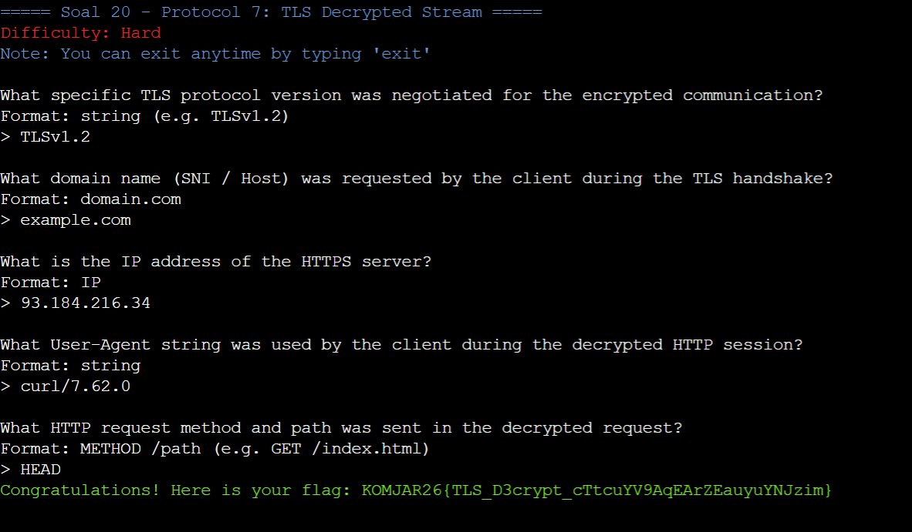

---

# Script Konfigurasi (`/root`)

## `/root/dns.sh` (tiap client)
```bash
#!/bin/bash
echo "nameserver 8.8.8.8" > /etc/resolv.conf
```

## `/root/cek_status.sh` (Lain)
```bash
#!/bin/bash
echo "Ringkasan Interface"
ip -br a
echo
echo "Status Tabel NAT"
iptables -t nat -L -v -n
```

## `/root/setup_ftp.sh` (Chisa)
```bash
#!/bin/bash
which vsftpd >/dev/null 2>&1 || { apt update || true; apt install -y vsftpd ftp; }

# buat user + password
id alice >/dev/null 2>&1 || useradd -m alice
id mika  >/dev/null 2>&1 || useradd -m mika
id eiri  >/dev/null 2>&1 || useradd -m eiri
echo "alice:alice123" | chpasswd
echo "mika:mika123"   | chpasswd
echo "eiri:eiri123"   | chpasswd

# folder share
mkdir -p /var/wired/data
chown alice:alice /var/wired/data
chmod 755 /var/wired/data

# override read-only khusus mika
mkdir -p /etc/vsftpd/user_conf
echo "write_enable=NO" > /etc/vsftpd/user_conf/mika

# blacklist eiri
echo "eiri" > /etc/vsftpd/user_list

# konfigurasi utama vsftpd
cat > /etc/vsftpd.conf <<'CFG'
listen=YES
listen_ipv6=NO
anonymous_enable=NO
local_enable=YES
write_enable=YES
local_umask=022
chroot_local_user=YES
allow_writeable_chroot=YES
local_root=/var/wired/data
user_config_dir=/etc/vsftpd/user_conf
userlist_enable=YES
userlist_file=/etc/vsftpd/user_list
userlist_deny=YES
seccomp_sandbox=NO
pam_service_name=vsftpd
CFG

service vsftpd restart
echo "[*] FTP ready"
```

## `/root/setup_telnet.sh` (Chisa)
```bash
#!/bin/bash
apt update || true
apt install -y telnetd inetutils-inetd
id phantom_user >/dev/null 2>&1 || useradd -m -s /bin/bash phantom_user
echo "phantom_user:wired_ghost" | chpasswd
sed -i '/telnet/d' /etc/inetd.conf
echo "telnet stream tcp nowait root /usr/sbin/telnetd telnetd" >> /etc/inetd.conf
service inetutils-inetd restart
```

---

*Catatan pengerjaan: konfigurasi node bersifat ephemeral saat restart kecuali `/root` dan `/etc/network/interfaces`. Karena itu layanan (FTP, Telnet, SSH) dibangun ulang dari script `/root` bila node di-restart; sementara konfigurasi jaringan inti (soal 1–5) pulih otomatis.*
